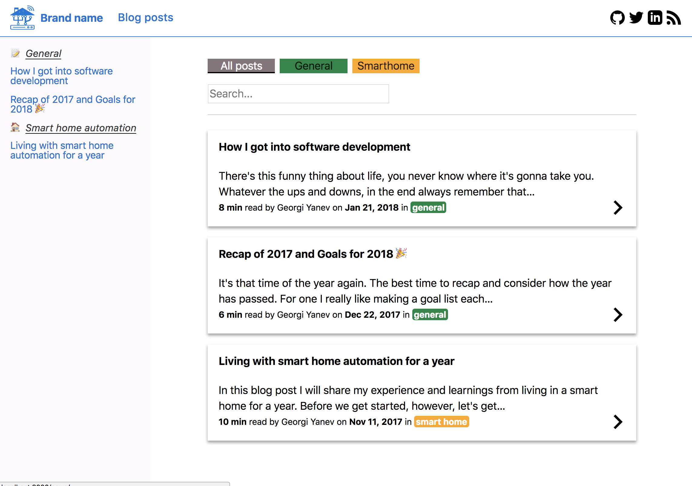
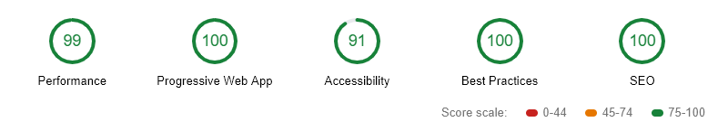

# Custom Gatsby blog starter

## Setup

```
$ gatsby new PROJECT_NAME https://github.com/jumpalottahigh/gatsby-starter-blog-jumpalottahigh
```

## Development

```
$ npm run dev
```

## Production build

```
$ npm run build
```

## Features

- SEO optimizations

  - open graph
  - google structured data
  - twitter cards

- UI

  - article list + image
  - search
  - filter by category
  - mobile friendly FAB + Drawer menu
  - reader feedback component
  - reading progress line component
  - related articles component

- sitemap
- rss feed
- social media links
- google analytics
- google tag manager
- prismjs

## Demo

https://blog.georgi-yanev.com

#### /


#### /news



#### Mobile FAB menu button and drawer


#### Lighthouse score



## Social Links

- [www.georgi-yanev.com](https://www.georgi-yanev.com)
- [blog.georgi-yanev.com](https://blog.georgi-yanev.com)
- [Facebook](https://www.facebook.com/jumpalottahigh/)
- [Twitter](https://www.twitter.com/jumpalottahigh/)
- [LinkedIn](https://www.linkedin.com/in/yanevgeorgi/)
